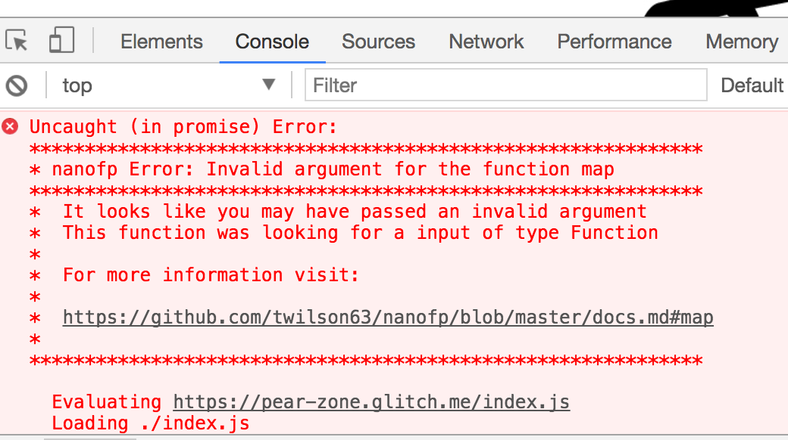
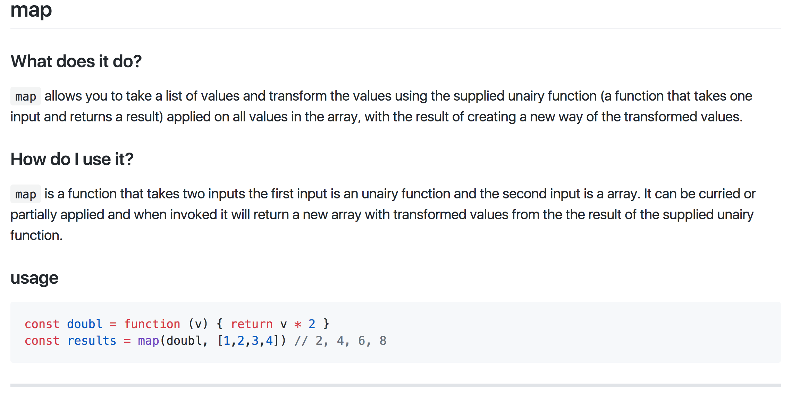

# nanofp

A tiny fp utils library

Currently this is an experimental library, if you are looking for a production functional library, please use Ramda!!

This library is mainly used for teaching functional javascript core concepts and should be used to prototype or learn with.

## Focus

This library's focus is clear error messages that really help new developers to use functional programming libraries.

When an error occurs you should get a clear message in the browser:

And the link should to take you to easy to understand documentation.

If you find the documentation needs improving please provide a pull request correcting the documentation or file an issue explaining why you are struggling with the library. This will help tremendously to make it better and more user friendly and approachable.

All of the documentation is in the [docs.md](docs.md) file and written in markdown, so it should be very easy to contribute to right inside github.

## Feedback

Please provide feedback about the library

## LICENSE

MIT

## CONTRIBUTING

Pull Requests are welcome

Use EditorConfig to make sure you use the correct editor formatting:

spaces 2 space indention.

Also, this project uses prettifier and airbnb as its linter without semis.

## Thank You

* JavaScript Community
* Functional JavaScript Community
* RamdaJS
* NodeJS
